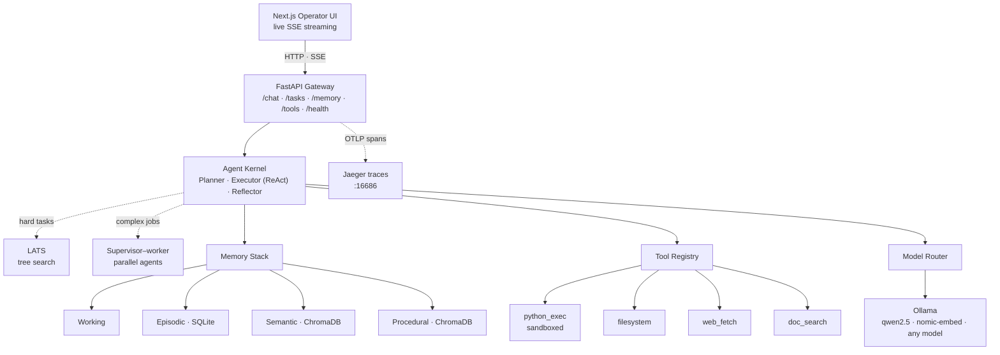
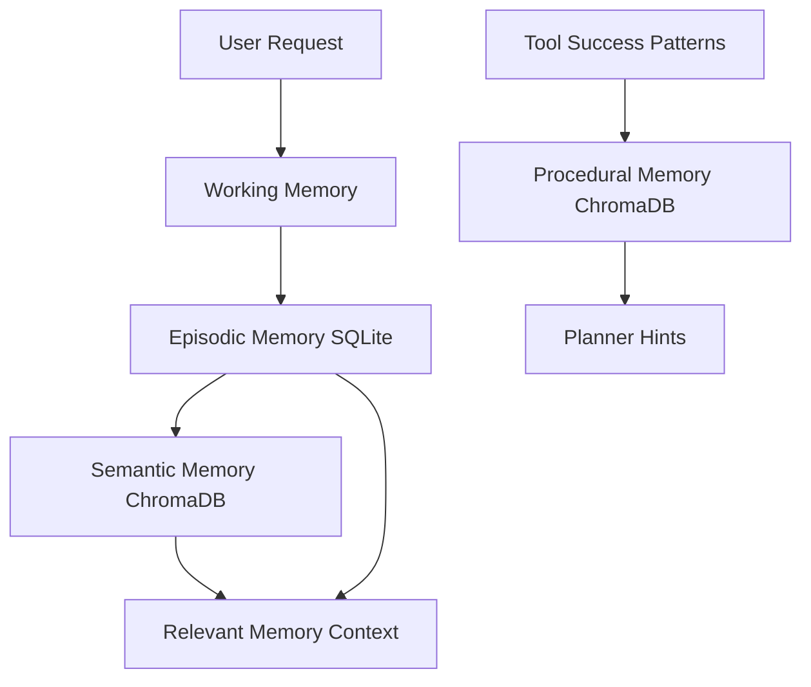

# CORTEX — Private Intelligence Framework

> "Intelligence that stays yours."

**A private AI agent that runs entirely on your own machine** — it plans, uses sandboxed tools, remembers you across sessions, and streams every step live, on a laptop GPU with 6 GB of VRAM. No cloud, no API keys, nothing leaves your computer.

[](https://github.com/roydonsequeira/CORTEX-Private-Intelligence-Framework/actions/workflows/ci.yml)


## What is CORTEX?

Cloud AI is powerful, but everything you send to it can be logged, retained, inspected, or used to train future models. Prompts, files, private notes, source code, and research questions leave your machine and enter systems you do not control.

CORTEX is a fully local, privacy-first AI agent framework that runs on your own hardware. It combines Ollama models, a production FastAPI runtime, a Next.js operator UI, four-tier memory, sandboxed tools, LATS reasoning, supervisor-worker orchestration, and OpenTelemetry observability without requiring cloud API keys.

## Built for small models: rules enforced in code, not prompts

Small local models break rules that prompts ask them to follow. Driving CORTEX with 187 real conversations against `qwen2.5:7b` showed exactly how: it claimed "I saved the file" without saving it, pasted a program again instead of saying it can't run, invented a number when its code printed nothing, stored "your name is Ada" from a JSON example, and followed an instruction hidden inside text it was asked to summarise. So the guardrails live in the agent code, where the model can't talk its way around them:

- **No tools for answers that don't need them** — a direct-answer or refusal plan runs with no tool schemas at all; destructive plans become a refusal before anything runs.
- **Quoted or pasted text is data** — it never counts as the user asking for a file write, a tool or a run, so injected instructions can't trigger actions.
- **Skipped or faked tool use is recovered** — if the plan and the user both call for a tool and the model answers without it, CORTEX runs the code the model wrote or asks for the tool, once.
- **"Run it" on a game or GUI program** gets an instant, honest answer (no window or keyboard in the sandbox, plus the local run command) instead of a repasted program.
- **Web fetch reaches public sites only** — loopback, private-network and cloud-metadata addresses are refused after DNS resolution and on every redirect.
- **Memory learns only what you say about yourself**, and only durable facts.

The [live test battery](evals/live_battery/) is in the repo: 39/39 on the test plan, 134/137 extra prompts (the rest fixed and re-run clean), 11/11 ops and security checks. It found 27 issues the unit tests had missed.

## Architecture



## Features

- **Multi-tier memory:** working → episodic SQLite → semantic ChromaDB → procedural tool patterns.
- **LATS-augmented ReAct:** Language Agent Tree Search for hard tasks where a linear loop stalls.
- **Supervisor-worker orchestration:** decomposes complex jobs into parallel sub-agent runs and aggregates results.
- **Sandboxed tool execution:** RestrictedPython code execution, filesystem guardrails, web fetching, document indexing.
- **Plugin-first tools:** drop a `BaseTool` subclass into `src/cortex/tools/plugins/` and restart.
- **Streaming API:** Server-Sent Events for plans, steps, tool calls, tokens, and completion events.
- **Operator UI:** terminal-inspired Next.js interface with memory search and execution trace panel.
- **OpenTelemetry by default:** FastAPI, model calls, tools, memory, and agent spans exported to Jaeger.
- **Release hardening:** request IDs, token bucket rate limiting, graceful shutdown, strict typing, CI.

## Quick Start

**Prerequisites:** [Ollama](https://ollama.com), Python 3.12+, Node.js 20+ (for the UI). About 6 GB of disk for the default models; a GPU with 6 GB+ VRAM is recommended (CPU works, slowly).

### Native (recommended for development)

```bash
git clone https://github.com/roydonsequeira/CORTEX-Private-Intelligence-Framework.git
cd CORTEX-Private-Intelligence-Framework
ollama pull qwen2.5:7b && ollama pull nomic-embed-text

python -m venv .venv
source .venv/bin/activate          # Windows: .venv\Scripts\activate
pip install -e .

cortex doctor                      # checks Python, config, Ollama, models, port, HTTPS
cortex serve                       # API on http://localhost:8000

cd ui && npm install && npm run dev   # UI on http://localhost:3000 (second terminal)
```

### Docker Compose (NVIDIA GPU)

Requires Docker with the NVIDIA Container Toolkit, plus `make`, `bash` and `curl`.

```bash
make up            # API, UI, Ollama and Jaeger
make pull-models   # pulls qwen2.5:7b and nomic-embed-text into the Ollama container
```

Open:
- UI: http://localhost:3000
- API docs: http://localhost:8000/docs
- Jaeger traces: http://localhost:16686

All ports are published on `127.0.0.1` only.

### Low-resource demo (no GPU)

For a laptop or quick live demo without a GPU, use the CPU-only stack, which points every model capability at a small model (`llama3.2:1b`):

```bash
make demo
make pull-models-demo
```

Same URLs as above. Answers are weaker than the default 7B model — this shows the machinery (planning, streaming, tool calls, memory, tracing), not frontier-model quality. Warm the model with one query before presenting, since the first call loads it.

### The `cortex` command

`cortex serve` runs uvicorn inside the environment CORTEX is installed in, so it cannot pick up another Python's `uvicorn` from `PATH` (which fails with `No module named 'cortex'`). It refuses to start on a busy port and warms the model in the background. `cortex doctor` checks the whole setup and prints the fix for anything wrong. `cortex reset-memory --yes` wipes stored memory for a clean start.

Telemetry export is off in the default `cortex.yaml` (no collector is running natively); the Docker stack turns it on for Jaeger.

## Configuration

All runtime configuration lives in `cortex.yaml` and can be overridden with `CORTEX_` environment variables. CORTEX finds `cortex.yaml` by walking up from the current working directory, so it works from any subdirectory; set `CORTEX_CONFIG` to point at an explicit config file.

| Key | Default | Description |
|---|---|---|
| `ollama_base_url` | `http://localhost:11434` | Ollama server URL |
| `ollama_model` | `qwen2.5:7b` | Chat and tool-calling model (FAST capability) |
| `reasoning_model` | `qwen2.5:7b` | Planner / LATS model (REASONING capability; the UI's Reasoning toggle) |
| `code_model` | `qwen2.5:7b` | Code model (CODE capability) |
| `embed_model` | `nomic-embed-text` | Embedding model |
| `ollama_timeout_seconds` | `300` | Per-request Ollama timeout (covers a cold model load) |
| `ollama_num_ctx` | `8192` | Context window pinned on every call |
| `ollama_keep_alive` | `30m` | How long Ollama keeps the model loaded between requests |
| `max_agent_steps` | `10` | ReAct step budget; at the limit CORTEX synthesizes a best-effort answer |
| `max_run_seconds` | `120` | Wall-clock budget per request; past it CORTEX gives a best-effort answer |
| `history_turns` | `6` | Prior turns of the session replayed into each request |
| `chroma_path` | `./.cortex/chroma` | Local Chroma persistence path |
| `db_path` | `./.cortex/cortex.db` | SQLite episodic memory path |
| `api_host` / `api_port` | `127.0.0.1` / `8000` | Bind address; loopback only by default |
| `api_key` | `null` | When set, require `Authorization: Bearer <key>` on all routes except `/health` and docs |
| `cors_origins` | `["http://localhost:3000", "http://127.0.0.1:3000"]` | Browser origins allowed to call the API (the local UI) |
| `cors_origin_regex` | loopback on any port | Also allows `http://localhost:<port>` / `127.0.0.1:<port>` (the UI moves to `:3001` if `:3000` is busy); set `null` to use `cors_origins` only |
| `allowed_hosts` | `["localhost", "127.0.0.1"]` | Accepted `Host` names (blocks DNS rebinding); add your host name to expose the API, or `["*"]` to disable |
| `debug_tool_endpoint` | `false` | Enable `POST /tools/{name}/execute`, which runs a tool directly, bypassing the agent |
| `task_store` | `memory` | Task result backend: `memory` (lost on restart) or `sqlite` (durable) |
| `task_db_path` | `./.cortex/tasks.db` | SQLite path for the durable task store |
| `telemetry_enabled` | `true` (`false` in the shipped `cortex.yaml`) | Export OpenTelemetry traces/metrics; `false` runs without a collector and without export warnings |
| `otel_endpoint` | `http://localhost:4317` | OTLP gRPC endpoint |
| `code_sandbox` | `restricted` | Code execution backend: `restricted` (in-process) or `container` (Docker isolation) |
| `stream_tokens` | `true` | Stream final-answer tokens from Ollama as they generate |
| `procedural_memory_enabled` | `true` | Learn tool-use patterns and feed them to the planner |
| `procedural_min_relevance` | `0.6` | Only patterns from near-duplicate past tasks become planner hints |
| `lats.enabled` | `false` | Enable LATS globally |
| `lats.max_depth` | `5` | LATS tree depth |
| `lats.n_branches` | `3` | LATS branch factor |
| `lats.budget` | `10` | LATS simulation budget |
| `lats.evaluator` | `model` | LATS state scoring: `model` (LLM) or `heuristic` (fast, no LLM) |
| `supervisor.max_workers` | `3` | Parallel worker limit |
| `rate_limit.enabled` | `true` | Enable API rate limiting |
| `rate_limit.requests_per_minute` | `200` | Default per-IP route limit |
| `rate_limit.chat_requests_per_minute` | `60` | Per-IP `/chat` limit |

## Tool System

Create plugins by inheriting from `BaseTool`, defining a JSON schema, and implementing `execute()`:

```python
from typing import ClassVar
from cortex.tools.base import BaseTool, ToolResult, ToolSchema

class EchoTool(BaseTool):
    schema: ClassVar[ToolSchema] = ToolSchema(
        name="echo",
        description="Echo input text.",
        parameters={
            "type": "object",
            "properties": {"text": {"type": "string"}},
            "required": ["text"],
            "additionalProperties": False,
        },
    )

    async def execute(self, **kwargs: object) -> ToolResult:
        return ToolResult(
            tool_name=self.schema.name,
            success=True,
            output=str(kwargs["text"]),
            execution_time_ms=0.0,
        )
```

Drop the file in `src/cortex/tools/plugins/` and restart CORTEX.

## Security Model

CORTEX is designed to run on hardware you control, and its guardrails are built for that threat model — chiefly to contain code the LLM generates when a prompt is malicious or injected.

- **Network exposure** is closed by default: the API binds to `127.0.0.1`, accepts browser calls only from local origins (CORS; loopback on any port), and only under local host names (a `Host` check that blocks DNS-rebinding attacks from web pages). The Docker stack publishes every port on `127.0.0.1`. To expose CORTEX, set `api_key` and widen `api_host`, `allowed_hosts` and `cors_origins` deliberately; `cortex serve` warns if you bind beyond loopback without a key. Direct tool execution (`POST /tools/{name}/execute`) is disabled unless `debug_tool_endpoint` is set.

- **Code execution** uses a pluggable sandbox backend selected by `code_sandbox`:
  - `restricted` (default) — compiled with RestrictedPython and run in a separate spawned process with a hard timeout. The attribute guard blocks dunder access and any traversal that would return a module object, closing escapes such as `json → codecs → sys → sys.modules['os']`. This is a best-effort in-process sandbox, **not** a guarantee against a determined adversary.
  - `container` — each snippet runs in an ephemeral Docker container with the network disabled, a read-only root filesystem, all Linux capabilities dropped, `no-new-privileges`, a tmpfs workdir, and CPU/memory/pid limits, so the OS process boundary is the real isolation layer. Use this for untrusted or multi-tenant workloads (`pip install 'cortex-agent[container]'`).
- **Filesystem** access is confined to a configurable workspace root, rejects `..` traversal and absolute or system paths with a clear "access denied", enforces read/write size caps, and restricts writable extensions. Writes never overwrite an existing file unless `overwrite: true` is passed, and never touch hidden paths (`.git`, `.venv`, `.env`, `.cortex`). There is no delete capability.
- **Prompt injection** is handled with least privilege rather than prompt wording alone: destructive requests are refused, and when the plan is a direct answer or a refusal the model is given no tools at all; at most three tool calls run per step; content from files, documents and web pages is treated as untrusted data; and every tool call is schema-validated, time-limited and traced.
- **Web fetch** reaches public hosts only: loopback, private-network, link-local (cloud metadata) and reserved addresses are refused after DNS resolution and again on every redirect hop, so a prompt or an injected page cannot use it to probe your machine or network. It honours `robots.txt`, verifies TLS against the operating system trust store, caps download and output size, and reports specific errors (HTTP status, timeout, offline).
- **Quoted and pasted text is data:** text you hand CORTEX to summarise, translate or analyse never counts as you asking for a file write, a tool or a run, and a file is overwritten only when you explicitly ask.
- **Calculator** evaluates an expression tree without `eval` and bounds exponents and factorials, so an expression like `9**9**9` cannot stall the API.
- **API** requests are validated with Pydantic, rate limited per IP with a token bucket, and refused while the server drains for graceful shutdown. Authentication is off by default for localhost; set `api_key` (e.g. via `CORTEX_API_KEY`) to require a bearer token on every route except `/health` and the docs, and narrow `cors_origins` before exposing the API beyond your machine.

Report security issues privately via a GitHub security advisory rather than a public issue.

## Memory Architecture



| Tier | Stored in | Holds |
|---|---|---|
| Working | process memory | scratchpad for the current request |
| Episodic | SQLite, `.cortex/cortex.db` (table `episodes`) | every user message, tool result and answer, per session |
| Semantic | ChromaDB, `.cortex/chroma` (collection `cortex_semantic`) | durable facts about the user and indexed document chunks, as embeddings |
| Procedural | ChromaDB, `.cortex/chroma` (collection `cortex_procedural`) | tool sequences that solved past tasks, used as planner hints |

Each request replays the session's recent exchanges from SQLite and retrieves relevant long-term facts from ChromaDB. After the answer, a background step extracts durable facts about the user — only from turns where you say something about yourself ("my name is…", "I prefer…"), so names inside data you paste are never learned as yours. Facts are keyed by their content, so re-learning one updates it rather than duplicating it.

Everything stays on disk under `.cortex/`. Inspect it with `GET /memory/sessions` and `GET /memory/search` (add `types=procedural` to see learned tool patterns), watch the server log for `procedural_pattern_saved`, `procedural_hints_used` and `working_memory_cleared`, and clear it all with `cortex reset-memory --yes`.

## Observability

CORTEX exports OpenTelemetry spans for HTTP requests, agent planning/execution/reflection, Ollama calls, SQLite memory, Chroma memory, tool execution, LATS, supervisor workers, and web fetches, plus metrics for model latency and agent steps. Logs are structured JSON with a request ID on every line.

With the Docker stack, traces appear in Jaeger at `http://localhost:16686`. Running natively without a collector, set `telemetry_enabled: false`.

## API Examples

```bash
curl -X POST http://localhost:8000/chat/message \
  -H "Content-Type: application/json" \
  -d '{"message":"Tell me the time","session_id":null}'
```

See [DEMO.md](DEMO.md) for reproducible examples.

## Implementation Status

| Phase | Description | Status |
|---|---|---|
| Phase 0 | Foundation, config, Docker, telemetry | Complete |
| Phase 1 | Model provider, router, agent kernel | Complete |
| Phase 2 | Multi-tier memory architecture | Complete |
| Phase 3 | Tool registry and built-in tools | Complete |
| Phase 4 | FastAPI API and SSE streaming | Complete |
| Phase 5 | Next.js operator UI | Complete |
| Phase 6 | LATS and supervisor multi-agent orchestration | Complete |
| Phase 7 | Observability, hardening, docs, release | Complete |

## Testing

```bash
pytest                 # 204 unit and integration tests (the model is mocked)
pytest -m ollama       # live tests against a running Ollama
ruff check src tests && mypy src tests   # lint and strict type checking
```

CI runs lint, tests, the UI build and the Docker build on every pull request. Each reliability bug found by running CORTEX against a live model has a regression test.

The [live test battery](evals/live_battery/) drives a running CORTEX like the UI does — 187 cases from basic questions to prompt-injection attacks — against an isolated database and workspace. It is how the bugs that only a real model produces were found.

## Roadmap

- [ ] Hybrid retrieval (BM25 + vector) with a reranker and mandatory citations
- [ ] Human handoff when the agent stalls or is not confident
- [ ] Merge near-duplicate memory facts before storing them
- [ ] Read-only workspace file access from the Python sandbox
- [ ] Azure OpenAI / OpenAI-compatible model adapter
- [ ] Voice I/O (Whisper + TTS, fully local)
- [ ] Vision tool (LLaVA integration)
- [ ] Multi-modal document processing
- [ ] Agent-to-agent networking (libp2p)

## Contributing

See [CONTRIBUTING.md](CONTRIBUTING.md) and our [Code of Conduct](CODE_OF_CONDUCT.md). Good first PRs include new tool plugins, memory backends, model provider adapters, and UI trace visualizations. Architecture decisions live in [docs/architecture-decisions](docs/architecture-decisions). Changes are tracked in [CHANGELOG.md](CHANGELOG.md); report vulnerabilities privately per [SECURITY.md](SECURITY.md).

## License

MIT
