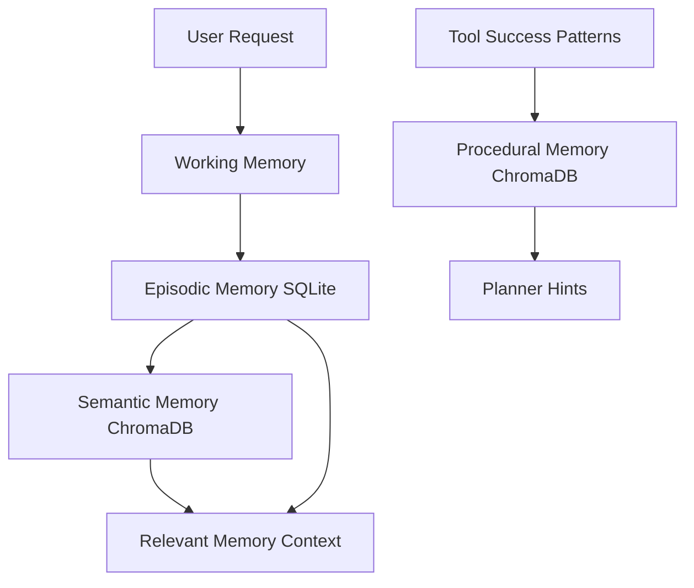

# CORTEX — Private Intelligence Framework

> "Intelligence that stays yours."


## What is CORTEX?

Cloud AI is powerful, but everything you send to it can be logged, retained, inspected, or used to train future models. Prompts, files, private notes, source code, and research questions leave your machine and enter systems you do not control.

CORTEX is a fully local, privacy-first AI agent framework that runs on your own hardware. It combines Ollama models, a production FastAPI runtime, a Next.js operator UI, four-tier memory, sandboxed tools, LATS reasoning, supervisor-worker orchestration, and OpenTelemetry observability without requiring cloud API keys.

## Architecture

```
┌─────────────────────────────────────────────────────────────────────────────┐
│                           CORTEX Runtime                                     │
│                                                                               │
│  ┌──────────────┐     ┌────────────────────────────────────────────────┐    │
│  │   Next.js UI │────▶│              FastAPI Gateway                    │    │
│  │  (Port 3000) │     │  /chat  /tasks  /memory  /tools  /health       │    │
│  └──────────────┘     └────────────────┬───────────────────────────────┘    │
│                                        │                                      │
│                        ┌──────────────▼──────────────┐                      │
│                        │        Agent Kernel          │                      │
│                        │  Planner · Executor · Reflector                    │
│                        │  ReAct · LATS · Supervisor                         │
│                        └──────────────┬──────────────┘                      │
│           ┌───────────────────────────┼───────────────────────────┐         │
│   ┌───────▼──────┐         ┌──────────▼─────────┐      ┌─────────▼──────┐  │
│   │ Memory Stack │         │   Tool Registry     │      │  Model Router  │  │
│   │ Working      │         │ Filesystem          │      │ Ollama         │  │
│   │ Episodic     │         │ Python sandbox      │      │ llama3.1:8b    │  │
│   │ Semantic     │         │ Web fetch           │      │ deepseek-r1    │  │
│   │ Procedural   │         │ Document search     │      │ nomic-embed    │  │
│   └──────┬───────┘         │ Plugin loader       │      └────────────────┘  │
│          │                 └─────────────────────┘                          │
│   ┌──────▼───────┐                                                            │
│   │ Local stores │ SQLite episodes · Chroma vectors                           │
│   └──────────────┘                                                            │
│   ┌───────────────────────────────────────────────────────────────────────┐  │
│   │ OpenTelemetry → OTLP gRPC → Jaeger UI (http://localhost:16686)        │  │
│   └───────────────────────────────────────────────────────────────────────┘  │
└─────────────────────────────────────────────────────────────────────────────┘
```

## Features

- **Multi-tier memory:** working → episodic SQLite → semantic ChromaDB → procedural tool patterns.
- **LATS-augmented ReAct:** Language Agent Tree Search for hard tasks where a linear loop stalls.
- **Supervisor-worker orchestration:** decomposes complex jobs into parallel sub-agent runs and aggregates results.
- **Sandboxed tool execution:** RestrictedPython code execution, filesystem guardrails, web fetching, document indexing.
- **Plugin-first tools:** drop a `BaseTool` subclass into `src/cortex/tools/plugins/` and restart.
- **Streaming API:** Server-Sent Events for plans, steps, tool calls, tokens, and completion events.
- **Operator UI:** terminal-inspired Next.js interface with memory search and execution trace panel.
- **OpenTelemetry by default:** FastAPI, model calls, tools, memory, and agent spans exported to Jaeger.
- **Release hardening:** request IDs, token bucket rate limiting, graceful shutdown, strict typing, CI.

## Quick Start

```bash
git clone https://github.com/roydonsequeira/CORTEX-Private-Intelligence-Framework.git
cd CORTEX-Private-Intelligence-Framework
make up
make pull-models
```

Open:
- UI: http://localhost:3000
- API docs: http://localhost:8000/docs
- Jaeger traces: http://localhost:16686

## Configuration

All runtime configuration lives in `cortex.yaml` and can be overridden with `CORTEX_` environment variables. CORTEX finds `cortex.yaml` by walking up from the current working directory, so it works from any subdirectory; set `CORTEX_CONFIG` to point at an explicit config file.

| Key | Default | Description |
|---|---|---|
| `ollama_base_url` | `http://localhost:11434` | Ollama server URL |
| `ollama_model` | `llama3.1:8b` | Default fast model |
| `embed_model` | `nomic-embed-text` | Embedding model |
| `chroma_path` | `./.cortex/chroma` | Local Chroma persistence path |
| `db_path` | `./.cortex/cortex.db` | SQLite episodic memory path |
| `api_host` / `api_port` | `0.0.0.0` / `8000` | FastAPI bind address |
| `api_key` | `null` | When set, require `Authorization: Bearer <key>` on all routes except `/health` and docs |
| `cors_origins` | `["*"]` | Allowed CORS origins; narrow this before exposing the API |
| `task_store` | `memory` | Task result backend: `memory` (lost on restart) or `sqlite` (durable) |
| `task_db_path` | `./.cortex/tasks.db` | SQLite path for the durable task store |
| `otel_endpoint` | `http://localhost:4317` | OTLP gRPC endpoint |
| `max_agent_steps` | `20` | ReAct loop budget |
| `stream_tokens` | `true` | Stream final-answer tokens from Ollama as they generate |
| `procedural_memory_enabled` | `true` | Learn tool-use patterns and feed them to the planner |
| `lats.enabled` | `false` | Enable LATS globally |
| `lats.max_depth` | `5` | LATS tree depth |
| `lats.n_branches` | `3` | LATS branch factor |
| `lats.budget` | `10` | LATS simulation budget |
| `supervisor.max_workers` | `3` | Parallel worker limit |
| `rate_limit.enabled` | `true` | Enable API rate limiting |
| `rate_limit.requests_per_minute` | `200` | Default per-IP route limit |
| `rate_limit.chat_requests_per_minute` | `60` | Per-IP `/chat` limit |

## Tool System

Create plugins by inheriting from `BaseTool`, defining a JSON schema, and implementing `execute()`:

```python
from typing import ClassVar
from cortex.tools.base import BaseTool, ToolResult, ToolSchema

class EchoTool(BaseTool):
    schema: ClassVar[ToolSchema] = ToolSchema(
        name="echo",
        description="Echo input text.",
        parameters={
            "type": "object",
            "properties": {"text": {"type": "string"}},
            "required": ["text"],
            "additionalProperties": False,
        },
    )

    async def execute(self, **kwargs: object) -> ToolResult:
        return ToolResult(
            tool_name=self.schema.name,
            success=True,
            output=str(kwargs["text"]),
            execution_time_ms=0.0,
        )
```

Drop the file in `src/cortex/tools/plugins/` and restart CORTEX.

## Security Model

CORTEX is designed to run on hardware you control, and its guardrails are built for that threat model — chiefly to contain code the LLM generates when a prompt is malicious or injected.

- **Code execution** is compiled with RestrictedPython and run in a separate spawned process with a hard timeout. The attribute guard blocks dunder access and any traversal that would return a module object, closing escapes such as `json → codecs → sys → sys.modules['os']`. RestrictedPython is a best-effort in-process sandbox, **not** a guarantee against a determined adversary. For untrusted or multi-tenant workloads, run the executor inside the provided Docker container so the OS process boundary is the real isolation layer.
- **Filesystem** access is confined to a configurable workspace root, rejects `..` traversal and absolute paths, enforces read/write size caps, and restricts writable extensions.
- **Web fetch** honours `robots.txt`, caps response size, and fails closed to an offline message when the network is unavailable.
- **API** requests are validated with Pydantic, rate limited per IP with a token bucket, and refused while the server drains for graceful shutdown. Authentication is off by default for localhost; set `api_key` (e.g. via `CORTEX_API_KEY`) to require a bearer token on every route except `/health` and the docs, and narrow `cors_origins` before exposing the API beyond your machine.

Report security issues privately via a GitHub security advisory rather than a public issue.

## Memory Architecture



## Observability

CORTEX exports OpenTelemetry spans for HTTP requests, agent planning/execution/reflection, Ollama calls, SQLite memory, Chroma memory, tool execution, LATS, supervisor workers, and web fetches.

Jaeger is available at `http://localhost:16686`.

Screenshot placeholder:

```
docs/assets/jaeger-trace-placeholder.png
```

## API Examples

```bash
curl -X POST http://localhost:8000/chat/message \
  -H "Content-Type: application/json" \
  -d '{"message":"Tell me the time","session_id":null}'
```

See [DEMO.md](DEMO.md) for reproducible examples.

## Implementation Status

| Phase | Description | Status |
|---|---|---|
| Phase 0 | Foundation, config, Docker, telemetry | Complete |
| Phase 1 | Model provider, router, agent kernel | Complete |
| Phase 2 | Multi-tier memory architecture | Complete |
| Phase 3 | Tool registry and built-in tools | Complete |
| Phase 4 | FastAPI API and SSE streaming | Complete |
| Phase 5 | Next.js operator UI | Complete |
| Phase 6 | LATS and supervisor multi-agent orchestration | Complete |
| Phase 7 | Observability, hardening, docs, release | Complete |

## Roadmap

- [ ] Voice I/O (Whisper + TTS, fully local)
- [ ] Vision tool (LLaVA integration)
- [ ] Multi-modal document processing
- [ ] Agent-to-agent networking (libp2p)

## Contributing

See [CONTRIBUTING.md](CONTRIBUTING.md) and our [Code of Conduct](CODE_OF_CONDUCT.md). Good first PRs include new tool plugins, memory backends, model provider adapters, and UI trace visualizations. Architecture decisions live in [docs/architecture-decisions](docs/architecture-decisions). Changes are tracked in [CHANGELOG.md](CHANGELOG.md); report vulnerabilities privately per [SECURITY.md](SECURITY.md).

## License

MIT
